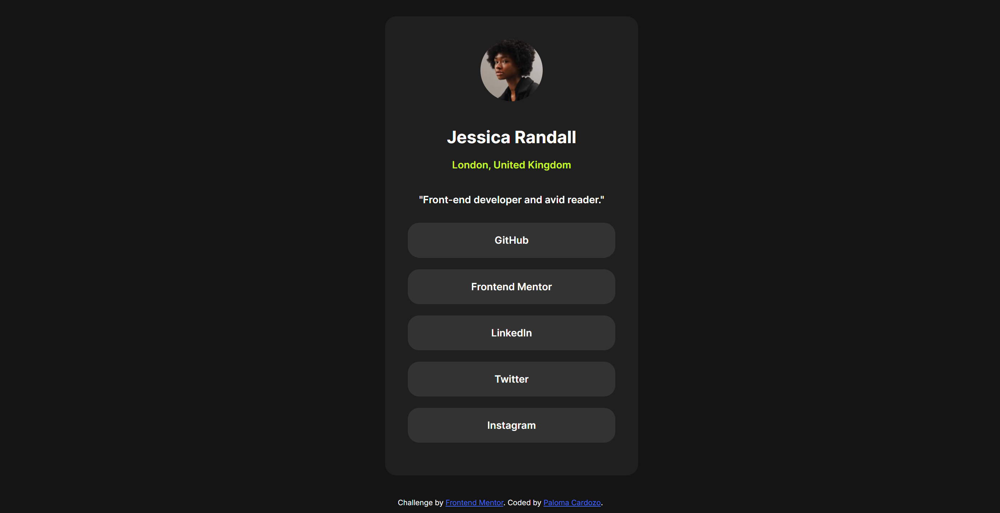

# Frontend Mentor - Social links profile solution

This is my solution to the Social links profile challenge on Frontend Mentor (https://www.frontendmentor.io/challenges/social-links-profile-UG32l9m6dQ). 

## Table of contents

- [Overview](#overview)
  - [The challenge](#the-challenge)
  - [Screenshot](#screenshot)
  - [Links](#links)
- [My process](#my-process)
  - [Built with](#built-with)
  - [What I learned](#what-i-learned)
  - [Continued development](#continued-development)
  - [Useful resources](#useful-resources)
- [Author](#author)
- [Acknowledgments](#acknowledgments)

## Overview

### The challenge

Users should be able to:

- See hover and focus states for all interactive elements on the page
- View the profile and links in a responsive layout
- See a fade-in animation on page load

### Screenshot

Here is a preview of my solution: 

### Links

- Solution URL: (https://www.frontendmentor.io/solutions/responsive-profile-card-with-animation-D2ztLsejRX)
- Live Site URL: (https://paloma-cardozo.github.io/Social-Links-Profile/)

## My process

### Built with

- Semantic HTML5 markup
- CSS custom properties
- Flexbox
- Vanilla JavaScript
- Accessibility best practices

### What I learned

This challenge helped me solidify my understanding of how to:

- Create clean and semantic HTML structures
- Use Flexbox to create responsive layouts
- Improve interactivity with hover and focus states
- Add smooth animations on load using JavaScript (`DOMContentLoaded` + `classList`)
- Make components more accessible to keyboard users

```js
window.addEventListener('DOMContentLoaded', () => {
  const card = document.querySelector('.card');
  card.classList.add('show');
});
```

### Continued development

I want to continue working on:

- Improving my JavaScript skills to build more dynamic components
- Practicing BEM and naming conventions in CSS
- Adding dark/light themes with CSS and JavaScript
- Writing more accessible code for all users

### Useful resources

- [MDN Web Docs](https://developer.mozilla.org/en-US/) - My go-to documentation for anything HTML/CSS/JS.
- [CSS Tricks](https://css-tricks.com/) - Helped me with layout.
- [Google Fonts](https://fonts.google.com/) - I used it to incorporate the 'Inter' font.

## Author

- Frontend Mentor - [@Paloma-Cardozo](https://www.frontendmentor.io/profile/Paloma-Cardozo)
- GitHub URL - [Paloma-Cardozo](https://github.com/Paloma-Cardozo)

## Acknowledgments

I would like to express my heartfelt thanks to my husband and my daughter, who keep reminding me every day why I love learning and creating. Their support and joy are my constant motivation.

I’m also grateful to my teachers at ReDI School for making web development feel less scary and more like an adventure.

Building this profile page may seem small, but for me it’s a symbol of progress, resilience, and the joy of learning something new.